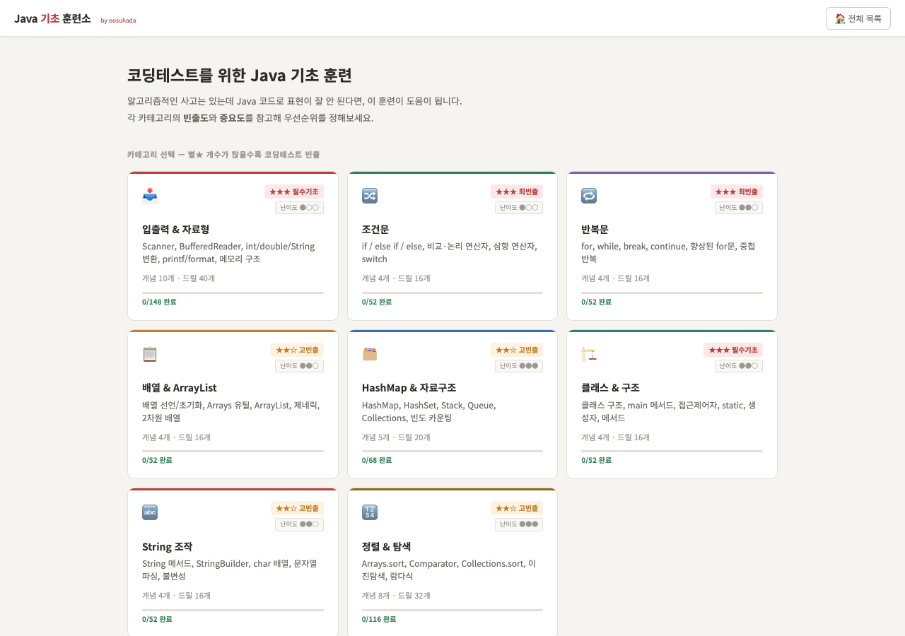

# JavaLingo — Java Coding-Test Fundamentals

코딩테스트를 준비하면서 Java 문법과 문제 풀이 기초를 짧은 drill 단위로 반복하기 위해 만든 정적 학습 도구입니다.

JavaLingo is a lightweight browser-based training tool for repeatedly practicing Java syntax and coding-test fundamentals through short, progressive drills.

**Live:** https://oosuhada.github.io/javalingo/

## UI Preview / 구현 화면



위 이미지는 현재 GitHub Pages에 배포된 실제 화면을 headless Chrome으로 캡처한 것입니다.

The screenshot above is captured directly from the currently deployed GitHub Pages application.

## Learning Flow / 학습 방식

- 주제별 Java 카테고리에서 필요한 개념을 선택합니다.
- 각 문제는 drill로 나뉘며 **Level 1 → 4** 순서로 반복합니다.
- 완료 상태와 진행도를 브라우저 `localStorage`에 저장합니다.
- 로그인이나 별도 backend 없이 정적 페이지에서 바로 사용할 수 있습니다.
- 학습 기록을 초기화하고 동일 문제를 반복 훈련할 수 있습니다.

## What This Shows / 이 프로젝트에서 보여주는 것

- Vanilla HTML/CSS/JavaScript 기반 학습 인터페이스
- category → question → drill로 이어지는 단계형 학습 UX
- 브라우저 저장소를 활용한 학습 진행도 관리
- Java 코딩테스트 공부를 직접 사용할 수 있는 작은 제품으로 바꾼 초기 frontend 실험

## Structure / 구조

```text
javalingo/
├── index.html                 # application shell
├── java-app-core.js           # navigation, progress, category flow
├── java-app-practice.js       # drill/practice interactions
├── java-data.js               # learning content
└── java-styles.css            # interface styling
```

## Run Locally / 로컬 실행

정적 사이트이므로 package 설치가 필요하지 않습니다.

```bash
python3 -m http.server 8080
```

Then open `http://localhost:8080`.

## Status / 상태

현재 GitHub Pages에서 동작하는 학습용 프로젝트입니다. 현재 대표 기술 스택을 보여주는 프로젝트보다는 Java 기초를 학습 도구로 구조화한 성장 기록으로 유지합니다.

This is intentionally kept as a small learning product and progression artifact rather than presented as a current flagship application.

## Topics

[`coding-test`](https://github.com/topics/coding-test) · [`css`](https://github.com/topics/css) · [`gamified-learning`](https://github.com/topics/gamified-learning) · [`github-pages`](https://github.com/topics/github-pages) · [`html`](https://github.com/topics/html) · [`java`](https://github.com/topics/java) · [`javascript`](https://github.com/topics/javascript) · [`learning-tool`](https://github.com/topics/learning-tool)
